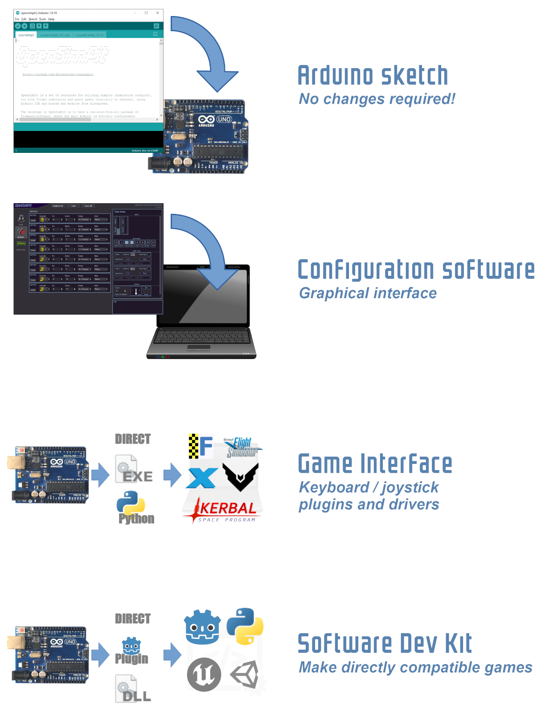
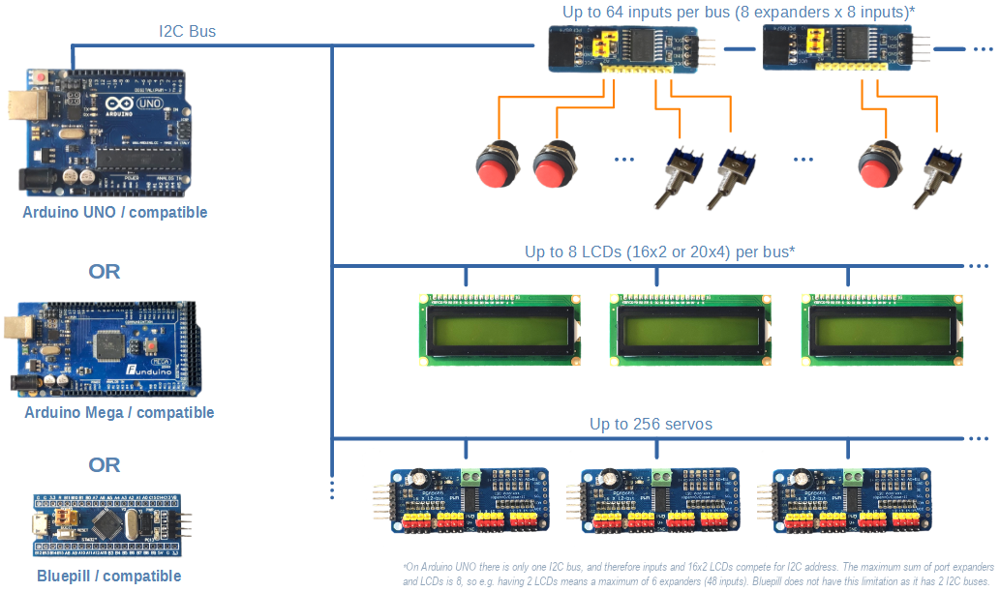
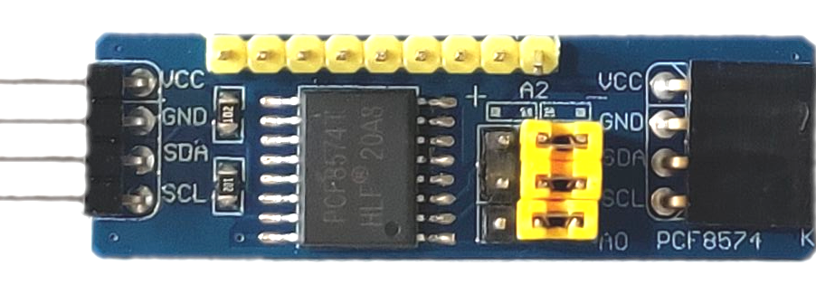
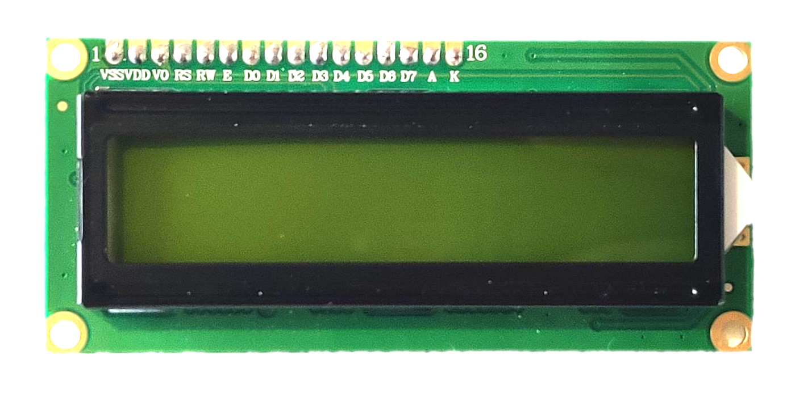
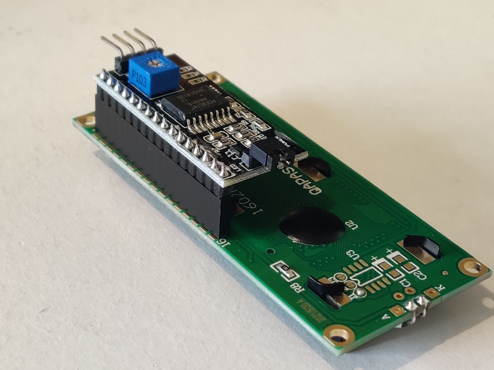
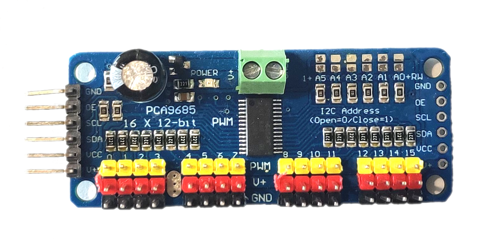

_Open source one-size-fits-all simulation cockpit based on Arduino_

----

OpenSimPit is a set of resources for building simpits (simulation gaming cockpits), for both flight simulators and space games (realistic or fantasy), using Arduino and boards/modules from aliexpress.

It started as the hardware side of a space flight game (currently a work in progress), but was made as a completely independent project, compatible with any game. It certainly can be used with realistic simulators like FlightGear and X-Plane, but the effort is to also keep it compatible with fantasy/arcade games such as Elite Dangerous and Kerbal Space Program, while remaining simple and straight-forward to use without much programming knowledge.

The strategy in OpenSimPit is to have a flexible, modular package of firmware/software, where the main board is entirely configurable via PC software to match your cockpit design (the board firmware code is not even aware of what your cockpit has). Using a simple protocol via serial port, the simpit can be used in any games accepting keyboard or joystick input via middleware drivers or apps, and an SDK is available to make your games read and send OpenSimPit data directly.

Most digital IO is via I2C, minimizing wiring and ensuring compatibility across boards. Some features (like analog axes and rotary encoders) use direct wiring to the board, so the number of those devices will change from board to board.

The focus is on cheap and widely available components to connect or solder yourself, so your shopping list will have things like a $2 I2C expansion board, not a $200 Airbus replica panel or the alike. 

The code can be deployed in your Arduino board without any coding at all (unless you want to add new features, of course - it's open source after all). This way, you can focus on the rest of the work - building and shopping for the nice gear - and set everything up with a clean "cockpit setup" software interface.

The cockpit connects with the host computer recognised as a USB Joystick (if using the Bluepill board) or via USB Serial port (all boards). The Serial port can be used directly in games compatible with OpenSimPit (``.dll``/``.so`` files will be provided for this, in this repository), or using a driver software on PC reading from the COM port and emulating a joystick (using e.g. vJoy).

----

## Features and modules currently supported

This project is under development and new features are being added. So the modules currently supported below are a "so far", as this list is growing in every version. 

### Analog Axes

Analog inputs coming from potentiometers or other analog output devices can be directly connected to the Arduino analog inputs. A total of 6 analog inputs are currently supported, being the physical limit of the Arduino Uno. Not much effort is being put on expanding this number as the vast majority of controls in a simpit are digital. Future versions might have this number increased for the Arduino Mega and Bluepill, though.

Also there is no effort being put into actual joysticks/yokes/wheels in any way as a DIY project will never beat the price and quality of an off-the-shelf mass production joystick. This project covers displays and controls more rarely (or never) found in shops (that is, everything else in a simpit). TL;DR: we don't care about actual joysticks. Just buy one if you need.

### PCF8574T 8 Pin I2C Port Expander

Inputs (buttons, switches, etc) are connected to expander boards, which are connected to the main board via 3 wires: SDA, SCL and IRQ. The main board only reads them if something has actually changed (via IRQ), therefore saving a lot of processing time compared to 74HC4067 multiplexers.

Since PCF8574T boards have 3 jumpers for address selection (8 address options), this version supports 64 inputs. (More inputs are planned by adding support to the TCA9548 I2C multiplexer.)

### 16x2 Characters LCD Displays

Up to 8 character displays are supported. The Arduino Uno only has one I2C bus, and the addresses for the LCD displays conflict with the port expanders, which means if you have 2 LCDs, you can only have 6 expanders (48 inputs), as the remaining 2 addresses are taken by the LCDs. This limit doesn't exist on the Bluepill board which has 2 I2C buses, and the LCDs are strategically placed separate from the expanders for this reason. The Bluepill is the recommended board for this project, by the way.

In order to be used in this project, the LCDs must have the I2C adapter board, as shown below. if you have the LCD without the I2C board, it can be purchased separately for very cheap on internet.

### PCA9685 Servo Controller

Up to 256 servos can be individually controlled via up to 16 PCA9685 controller boards (16 servos each). Due to high power consumption during movement, avoid using servos for things which change constantly during the game (such as an altitude dial) as this keeps current surges happening across the system. Prefer to use servos for things which only change responding to certain events (such as changing modes of operation, turning on/off, opening/closing lids, etc).

----

## Repository Contents

This repository contains:

  - Main Arduino sketch -> the firmware for your cockpit main board. No changes required.

  - Secondary Arduino sketches where needed -> some features (like the Open-Smart battery display) might use a small Arduino Pro Mini as middle-man to bridge into the I2C network. (WIP, coming soon)
  
  - PC Configuration Software -> the graphical tool used to configure your board to let it know what your simpit has, what, where, how. It is made in Godot Engine and is also open source.
  
  - PC Serial Driver Software -> allows you to connect your simpit via Serial port into any games by translating into a virtual joystick. You don't need this if you use a Bluepill board in USB Joystick mode, as it works directly like a USB joystick. Currently made in python and also open source - an executable binary (faster) C version is planned. (WIP, coming soon)
  
  - SDK for game developers (as ``.dll``/``.so``) for making games _directly_ compatible to OpenSimPit via Serial port (and therefore not requiring a Bluepill board). This includes:
    - General purpose library (the ``.dll``) to be used anywhere a ``dll`` can be used
    - Python module to be dropped into any python project (relies on pySerial)
    - Godot Engine addon plugin with GDScript `OpenSimPit` autoload ready to be dropped in projects (the software configurator uses this plugin)
    - Equivalent of the above but for Unity3D (help is welcome on that)
    - Equivalent of the above but for UE (help is welcome on that)
    
    Game developers don't really _need_ the SDK, it is just a convenience: any programming language capable of reading a serial port can read the OpenSimPit packets directly as they are simple JSON strings (the SDK includes a sample python script to do this). (WIP, coming soon)

----

## OpenSimPit Protocol

The best way is to use the configuration app to configure and the plugins or driver apps to operate. But in case you want to fiddle with the protocol, it is very simple: messages going from PC to board use the format `COMMAND=arg1,arg2,arg3,...` while messages going from the board to PC are JSON strings. Both end with newline (`\n`). The serial port uses baud rate `115200`, `8` data bits, no parity and `1` stop bits (`8-N-1`).

The following commands are understood:

### Configuration Commands

The OpenSimPit board stores the configuration - that is, information about your setup - in the board EEPROM (FLASH in case of Bluepill). 

You can configure the board without saving, item by item, in order to test and experiment, and when you're happy you can save it permanently as is. If you don't like the configuration or set something by mistake, unfortunately you have to start all over. There is no command to undo or remove an item, because it was designed to be used with the configuration software (where you can do this graphically).

The commands below can be used to manipulate the internal configuration. None of them is permanent: they all operate in "draft" mode, and to be permanent you have to save the config afterwards (even `CLEAR` is draft).

  * `CLEAR` -> Removes all items in the configuration and starts over with a blank one. All inputs and outputs in the board will cease immediately.
  
  * `DUMP` -> Outputs a JSON string containing all the current configuration stored in the board. This is used by the configuration software to read the board, and is not expected to be human friendly.
  
  * `RELOAD`-> Discards the entire draft and any unsaved changes, and restores the configuration as previously stored in permanent memory.
  
  * `SAVE` -> Saves the current draft to permanent storage, replacing any previous saved configurations. This is the only command that modifies the permanent storage.
  
  * `AXIS=pin_number,axis_number` -> Adds an axis mapping, where `pin_number` is in the range `0`-`5` (respective to board pins `A0` to `A5`), and `axis_number` is in the range `0`-`5` corresponding to analog axes `0`-`5` if using the Serial port, and joystick axes `X`, `Y`, `RX`, `RY`, `Slider Right` and `Slider Left`, respectively, if using the USB Joystick (Bluepill). The board will start outputting data immediately after this is sent.
  
  * `AXIS=pin_number,axis_number,value_min,value_max` -> Same as the command above, but also optionally specifying a value remapping. Values are in the range `0`-`1023`, and specify the range measured in the board pin corresponding to the full logic range in the output. E.g. `AXIS=1,0,300,700` will map pin `A1` to axis `0`/`X` where only values measured in the range `300`-`700` are used and are mapped to the axis full range (a value of `300` in the pin causes the output `0` - bottom of scale - and the value `700` in the pin causes the output `1023` - top of scale).
  
  * `BTN=expander_number,expander_pin,button_number` -> Adds a button mapping, where `expander_num` identifies the PCF8574T board in the range `0`-`7`, `expander_pin` is the pin in that expander, and `button_number` is the button number in the output in the range `0`-`63` if using the Serial port or `0`-`31` if using the USB Joystick. Notice the expander must be in the reading range (see below). E.g. `BTN=2,5,1` maps the pin 5 (the 6th pin) in expander 2 (the 3rd expander) to the button `1` (the 2nd) - and in this case expander 2 must be active (`EXP` command with 3 or higher). The expander addresses `0`-`7` correspond to I2C addresses `0x20`-`0x27`, respectively, and can be checked in the yellow jumpers `A0`, `A1` and `A2`.
  
  * `BTN=expander_number,expander_pin,button_number,invert,toggle` -> Same as the command above, but also specifying the `invert` flag (which inverts the button polarity) as `0` or `1`, and the `toggle` flag (which causes a short button press whenever the pin changes) as `0` or `1`. E.g. `BTN=2,5,1,1,0` behaves the same as `BTN=2,5,1` but with inverted polarity, while `BTN=2,5,1,0,1` causes a short button press whenever the pin 5 in expander 2 changes (high or low). The toggle mode is used when the simpit has an on/off switch, but the game expects the feature to be toggled by pressing the same key again.
  
  * `EXP=number_of_expanders` -> Sets the number of expanders which will be read when reading inputs. Since the first expander is number `0` (and not number `1`) this will be one number higher than the highest used expander address (e.g. if using expanders 0, 1 and 2, you should use `EXP=3`).
  
  * `LCD16X2=lcd_address,lcd_number` -> Enables a 16x2 character LCD display and maps the address (in the range `0`-`7`) to a logical number (in the range `0`-`7`). The LCD I2C address range is reversed compared to the button expanders: LCD addresses `0`-`7` correspond to I2C addresses `0x27`-`0x20`, respectively. An unmodified port expander has address `0`=`0x20`, while an unmodified LCD has address `0`=`0x27` and do not conflict. The mapping to an LCD logical number exists to be able to swap or move LCDs in the simpit without having to resolder jumpers or modify game plugins.

### Control Commands

Commands below expect a configuration to be already made and effective in the board, and are used during gameplay to control the simpit. Control commands start with `!` and are abbreviated to use the least amount of characters possible to save serial bandwidth.

  * `!LCC=lcd_number` -> Clears the character display with the given number. E.g. `!LCC=0` clears the LCD mapped to number `0`.
  
  * `!LCB=lcd_number,backlight` -> Sets the LCD backlight as on (`1`) or off (`0`). E.g. `!LCB=0,1` turns the backlight on for LCD number `0`.
  
  * `!LC=lcd_number,row,column,message` -> Prints the message in the LCD of the given number, starting at the given row and column (both start at 0). E.g. `!LC=0,1,3,Hello!` prints the text "Hello!" in the LCD number `0` at row `1` (2nd) starting at column `3` (the 4th).
  
  * `!S=servo_number,percentage` -> Sets the position of the servo of the given number, to the given percentual value. Value must be an integer. E.g. `!S=18,50` sets the servo number `18` to `50%` (center). Servos are considered to be sequential in the PCA9685 boards, that is, servo `15` is output `15` in board `0`, while servo `16` is output `0` in board `1`. Servo 18 is output `2` (the 3rd) in board `1` (the 2nd).
  
 
### Reading from OpenSimPit

Data coming from OpenSimPit to the PC is in JSON format. The top level is an object/dictionary, and can have the following keys (none are mandatory).

#### During Gameplay

  * `axis` -> value is a subobject/subdictionary containing axes values with axes numbers as keys.
  
  * `btn` -> value is a subobject/subdictionary containing button values with button numbers as keys.
  
  * `msg` -> value is a text message containing a response or warning about the board operation.
 

#### After Board Boot

When the board is connected, it outputs an initialization string containing the following keys:

  * `msg` -> "INIT"
  
  * `board` -> value is a string identifying the board. Possible values are `Arduino Uno`, `Arduino Mega`, `Bluepill`, `Undefined board`. 
  
  * `usb_connected` -> `0` or `1` identifying if the board is operating in USB Joystick mode (`1`) or Serial port (`0`).

#### Caused by `DUMP` Command

When the `DUMP` command is sent, the board sends a JSON message containing the following keys:

  * `ver` -> firmware (Arduino sketch) version, currently "0.2"
  
  * `board` -> same as after board boot
  
  * `usb_connected` -> same as after board boot
  
  * `used_axes` -> the number of axes mapped
  
  * `axes` -> a subobject/subdictionary containing all currently mapped axes

  * `used_expanders` -> the number of expanders set via `EXP`
  
  * `used_buttons` -> the number of buttons mapped

  * `buttons` -> a subobject/subdictionary containing all currently mapped axes
  
  * `lcd16x2` -> a subobject/subdictionary containing all the 8 possible mappable character displays