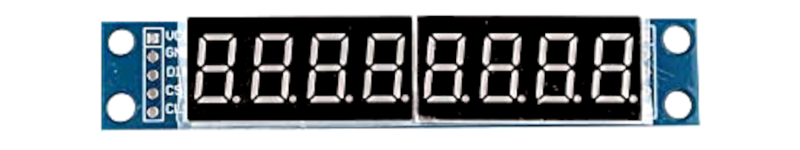
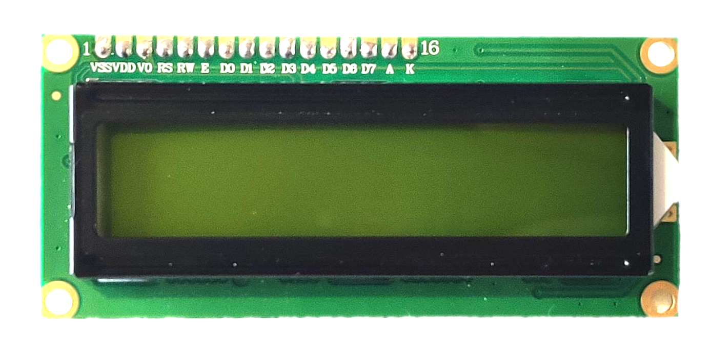
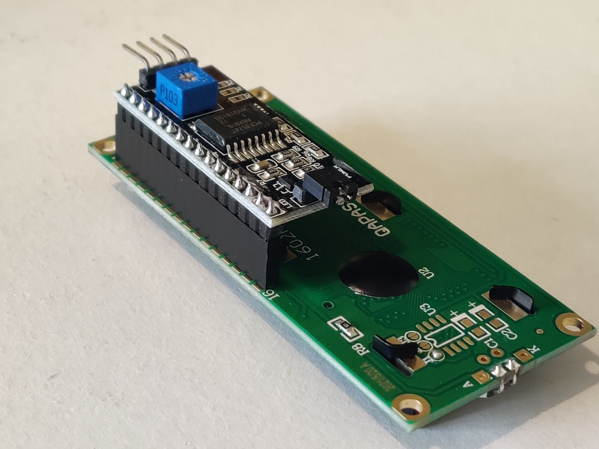
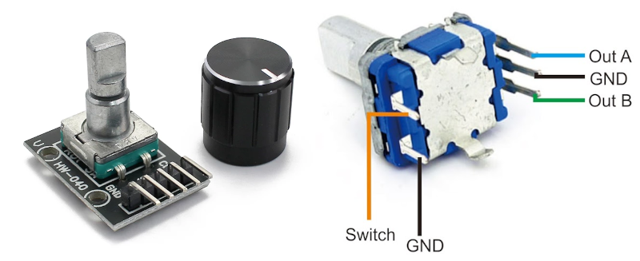
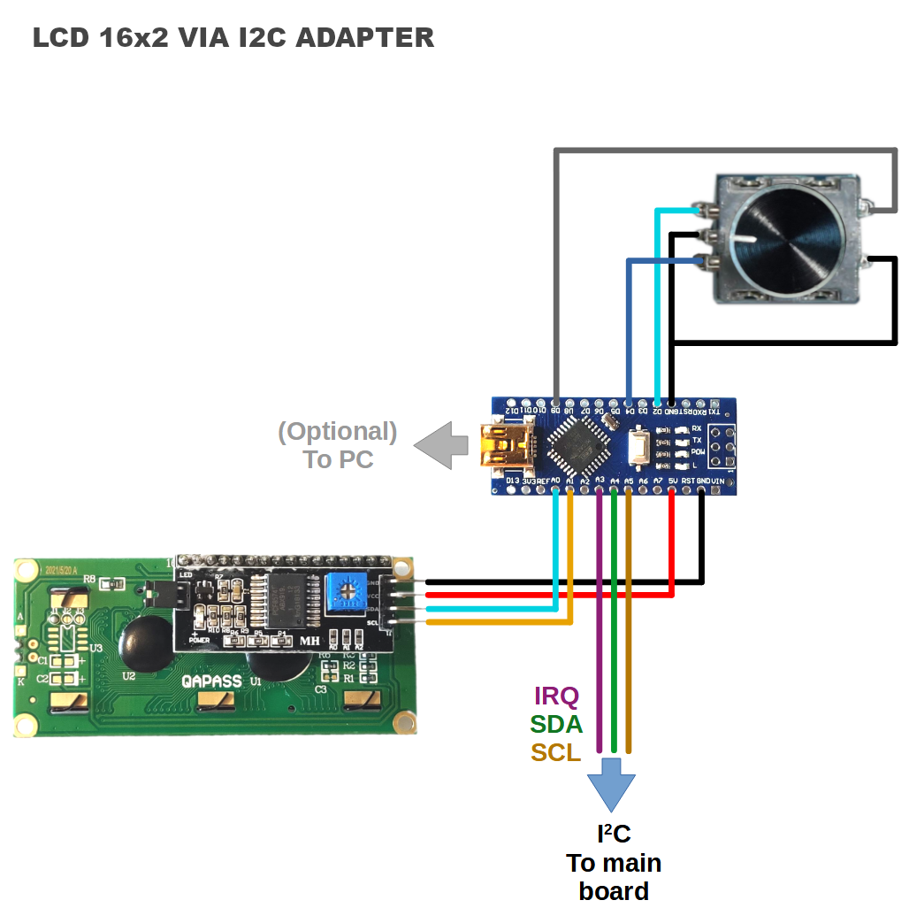
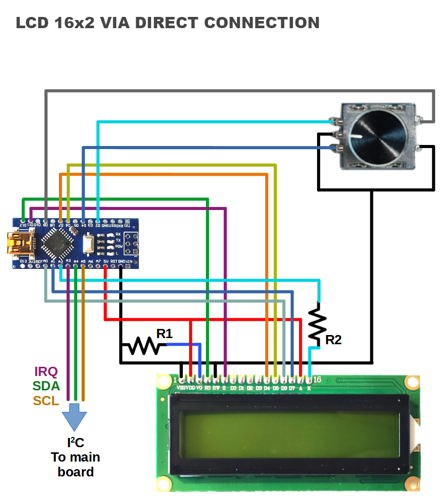
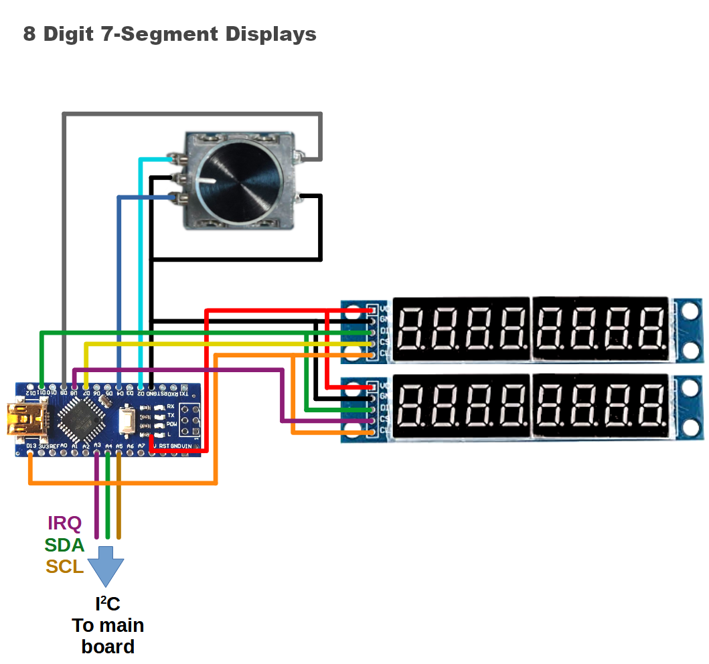

_Open source one-size-fits-all simulation cockpit based on Arduino_

----

# OpenSimPit Radio Module

This sketch is for a secondary Arduino board working as a radio module. This is not the main OpenSimPit board sketch. (The main sketch is [here](README.md).)

The radio module is designed to work specifically on an Arduino Nano. It should work with Arduino Uno as well (because it's the same chip), but no other model was tested.

This board can be used as module connected to an OpenSimPit main board via I2C, or it can be used as a standalone radio module connected to PC via serial port. 

The radio sketch can be found [here](https://github.com/fbcosentino/opensimpit/tree/main/arduino_sketch/radio).

### Connection to PC as Standalone Radio Module

Games and applications supporting OpenSimPit directly (via the plugins available in this repository) do not need anything special, and the radio module will be seen as if it was an OpenSimPit installation having only the radio module. For games and apps not offering direct support, a special driver application is needed (examples provided in this repository as well).

## Display Options

This module can be used with the following types of display:

 - 8 digits 7-segment LED displays (often sold as "tube" display),
   based on MAX7219 chips or similar. Uses 2 displays (one for active
   frequency and one for standby)
   

**OR**

 - 16x2 characters LCD display directly connected (via RS, EN, D4-D7). Uses a single display for both frequencies.

**OR**

   
 - 16x2 characters LCD display (same as above) connected via I2C adapter board. Uses a single display for both frequencies.
   

   
   
## Additional Components
   
The Sketch also expects a rotary encoder with integrated push button. If using an encoder without push-button, then a separate button must be connnected.

## Functions

One Arduino board with this sketch works as the entire radio stack, even if information about just one radio is shown on display. During operation one of the functions below can be selected:
 - COM1
 - NAV1
 - COM2
 - NAV2

The function can be changed at any time during operation via push-button, so a single radio module can control all four devices in the game/simulator.

- A short click toggles between coarse and fine adjustments - coarse being steps of `1 Mhz`, and fine being `0.025` MHz for COM and `0.05` MHz for NAV. 
- A long click (more than 0.6s) swaps the active and standby frequencies. 
- A double click enters the function selection menu (to select between COM1, COM2, NAV1 and NAV2), where a short click selects.

The plan is to expand this Sketch to work as a full 4-radio stack, using eight 7-segment displays or four LCDs with I2C adapters (direct connection not available) controlled via two rotary encoders (shared by a COM/NAV pair each). The board already contains the full radio stack internally and only one board is needed - but for now it only modifies (in the game/simulation) the selected function at a time. For full immersion, as a dirty workaround (while the full stack 8 displays code is not available) if the radio module is directly connected to a PC, four Arduinos could be used, each set as one function. To connect to the OpenSimPit main board, a single Arduino must handle all the radio stack, which for now means sharing the display.

----

## Wiring

Each display option has a different wiring, as below. Encoder output `A` (`CLOCK`) connects to Arduno pin `2`, and Output `B` (`DT`) connects to pin `4`. If the encoder behaviour is reversed (turning right decreases frequency), swap those two wires. Pins `3` and `5` are reserved for the second encoder (TODO).

Wiring to a 16x2 Character LCD via I2C is the easiest, and provides the most compact installation and panel area. If you are not trying to replicate any aircraft model in particular and are comfortable with your own cockpit layout, this might be the best alternative, as it is easy to assemble and wire, easy to cut holes in the panel, and easy to read data as the characters have better drawings compared to 7-segment displays.

If connecting to PC as standalone module, the three I2C wires to main board can be disregarded. Just connect a USB cable to PC and the serial port should be automatically recognised in all major operating systems. (This applies to all display options.)

This version is not recommended as it has no advantages compared to using an I2C display. The firmware supports this option because you might have a display already which doesn't have the adapter board, and therefore you can still use it without having to buy a new adapter or whole display. The wiring is not straight-forward to preserve the wiring of the other components (encoders and main board) as several functions in the Arduino Nano have fixed pins. 

TL;DR: If you are buying components to make a brand new cockpit, avoid this.

`R1` is usually a trimpot for contrast adjustments, but a fixed resistor can be used for fixed contrast set. A value in the range `3.3k` - `4.7k` should work, but experiment to find the best result for you. (Do not connect directly without the resistor.)

`R2` is usually in the range `220` - `470` but some boards might have a resistor already and direct connection could be possible (at your own risk). Can be connected to GND instead of Arduino pin A2 to keep the LCD backlight always on.

This option uses two 8 digits 7-segment LED displays, driven by MAX7219 or similar, to closely simulate the look and feel of several traditional aircraft radio modules. The first two leftmost digits of each display are used to indicate function (with a small `ci` and `cii` for COM1 and COM2, and `ni` and `nii` for NAV1 and NAV2).

Not all display boards on the market support "daisy chaining", so for best compatibility the wiring has `Vcc`, `GND`, `DIN` and `CLK` all in parallel, and dedicated `CS` lines per display.

Future versions will support using eight displays of six digits each, for the full stack of COM1+NAV1+COM2+NAV2. (The Arduino already _is_ the full stack internally, only displaying the information is limited.)

----

## Video Examples

### 16x2 Character Display

https://user-images.githubusercontent.com/28926813/194771263-11a184f4-4155-4f75-8549-3fb94f5cc530.mp4

### 8 Digit 7-Segment Displays

https://user-images.githubusercontent.com/28926813/194771275-6a9845ea-7193-4a62-8aaf-a906357266f5.mp4