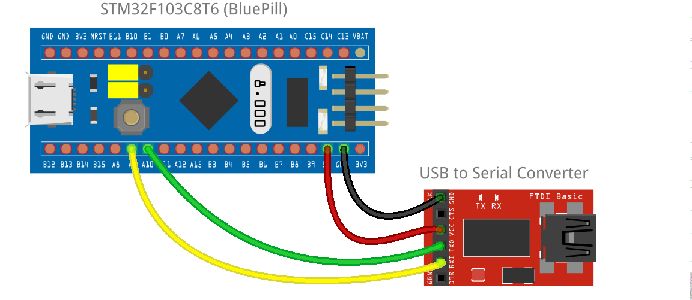

_Open source one-size-fits-all simulation cockpit based on Arduino_

----

# OpenSimPit Arduino Sketches

The OpenSimPit hardware system is based on a main board (Bluepill, Arduino Mega or Arduino Uno) connected to peripherals via I2C buses. 

Sometimes a device is not compatible to I2C and there is no simple, cheap I2C adapter board for it. In other cases, processing and data bandwidth can be saved by having a self-sufficient functional unit handled by a daughter Arduino board connected to the I2C bus (that's the case of the Radio module). In those cases, separate Arduino sketches are available.

## Main Board

The main board is one of the following supported boards (the same sketch is used for all):

- Bluepill (recommended option)
- Arduino Mega
- Arduino Uno

The main sketch can be found [here](https://github.com/fbcosentino/opensimpit/tree/main/arduino_sketch/opensimpit).

If using the Bluepill, an extra library (`STM32F103C8T6` driver) must be installed in the Arduino IDE to be able to compile the sketch, and you need a USB-to-Serial adapter connected to pins A9 and A10. 

\*\*\* **_This is not needed for the other boards, which work out-of-the-box._** \*\*\*

### Bluepill Board

**(You don't need this if you are not using the Bluepill board.)** To prepare the Arduino IDE for the Bluepill board, follow these steps in the Arduino IDE:

- `File` -> `Preferences`
- On `Additional Boards Manager URLs`, insert `http://dan.drown.org/stm32duino/package_STM32duino_index.json` (if there are more URLs there already, separate them with a `,`)
- `Tools` -> `Board: (...)` -> `Boards Manager...`
- Search for "STM32" 
- Look for `STM32F1xx` (at the time of writing, it was called `STM32F1xx/GD32F1xx boards`) and install it
- `Tools` -> `Board: (...)` -> `STM32F1 Boards` -> `Generic STM32F103C series`
- `Tools` -> `Variant` -> `STM32F103C8` (will probably be already selected)
- **Important**: `Tools` -> `Upload Method` -> `Serial` (every time you switch to a different board and go back to the STM32F103C, this will be set back to the `STM32duino` option and you have to select back `Serial` or uploading will fail)
- `Tools` -> `CPU speed` -> `72MHz`
- `Tools` -> `Port: (...)` -> select the serial port for your USB-to-Serial adapter (once connected)

The USB-to-Serial adapter connection is done as below:

\*\*\* **_This is not needed for the other boards, which work out-of-the-box._** \*\*\*

### Wiring

The OpenSimPit main board uses fixed pins groups for the function categories, as below:

#### I2C Bus

- Bluepill: digital inputs (via expanders) are connected to the bus at pins `B7` (SDA) and `B6` (SCL), while displays and digital outputs (via expanders) are connected to the bus at pins `B11` (SDA) and `B10` (SCL).
- Arduino Mega: all devices connected to the bus at pins `20` (SDA) and `21` (SCL)
- Arduino Uno: all devices connected to the bus at dedicated I2C pins (near `AREF`) if those are available, otherwise pins `A4` (SDA) and `A5` (SCL).

#### IRQ Inputs

The following input pins are used to read interrupts coming from modules:

- Digital input port expanders (buttons): pin `A7` on Bluepill, pin `6` on all other boards.
- Radio Stack module: pin `B9` on Bluepill, pin `9` on all other boards. 

#### Analog Inputs

All boards support a maximum of 6 analog inputs directly connected to the pins `A0` to `A5`, except Arduin Uno which supports 4 inputs `A0` to `A3` (as pins `A4` and `A5` are the I2C bus).

#### Rotary Encoders

General purpose rotary encoders are still not implemented, but pins `2` to `5` are reserved for them.

----

## Radio Stack

Please check the [Radio Stack Documentation](RADIO.md).